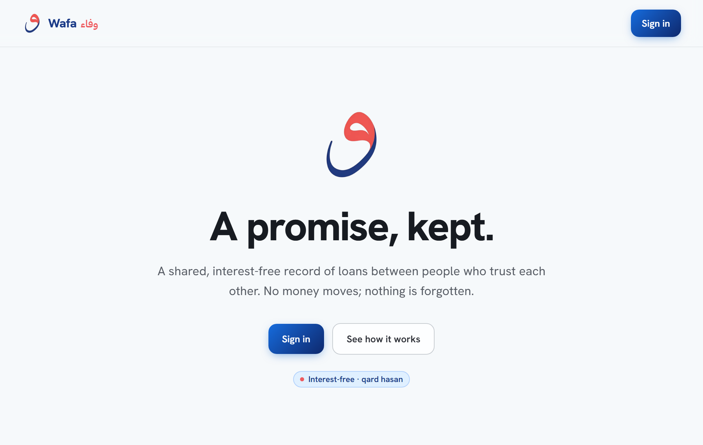
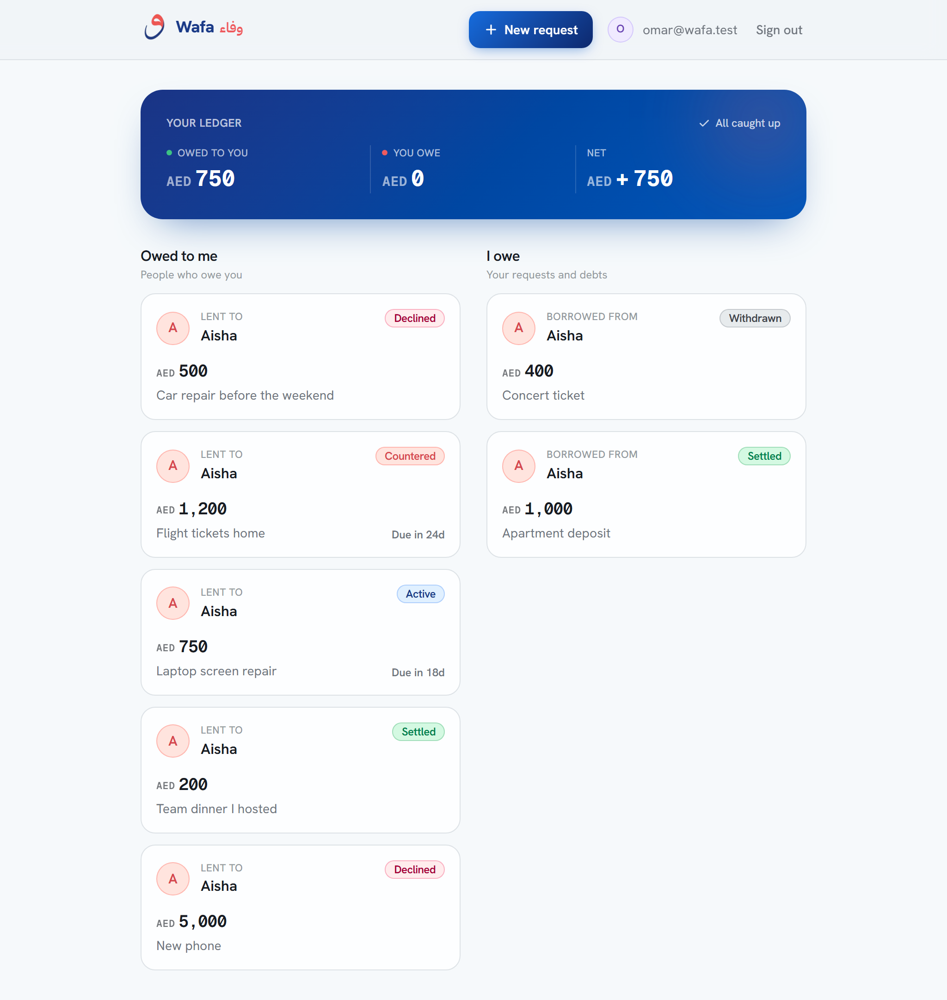
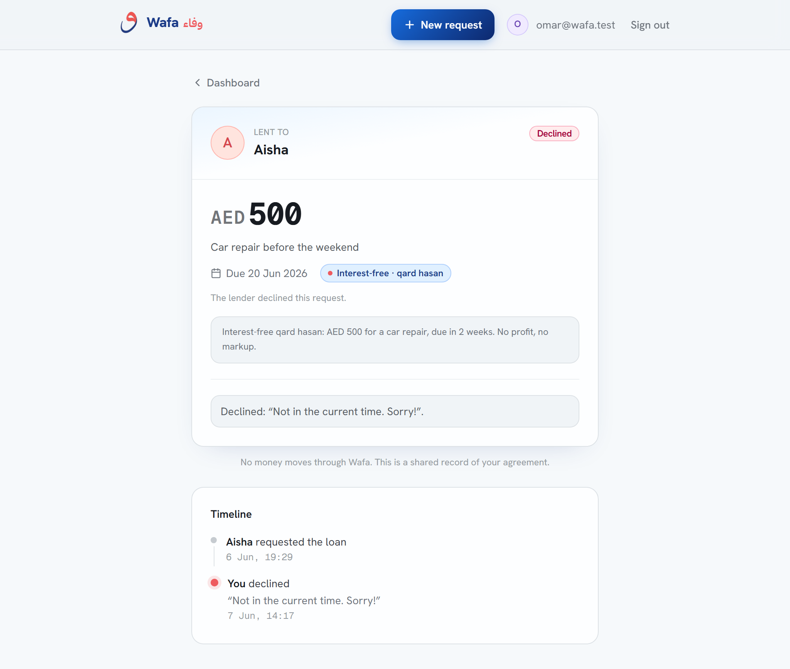
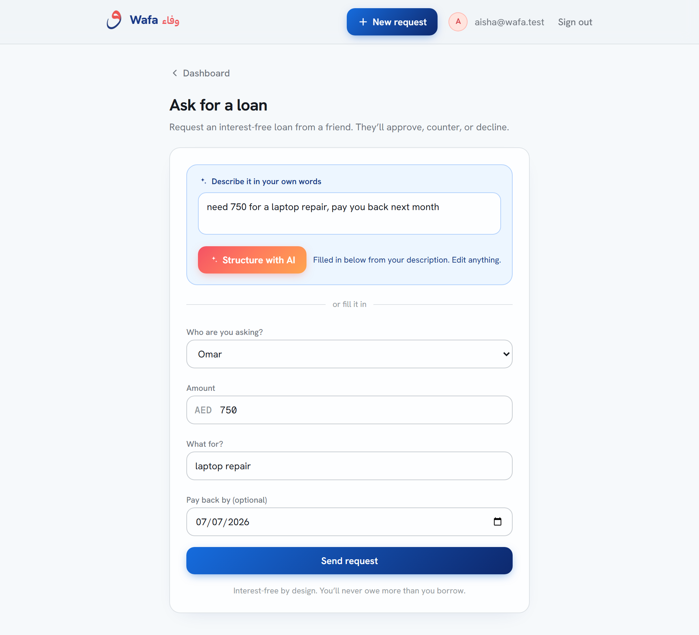

# Wafa — وفاء

**Zero-interest, qard-based lending between friends. Agreed, tracked, repaid.**

Wafa is a small, deployed web app for one clean **request → review → decision** flow: a friend
requests an interest-free loan ([qard hasan](https://en.wikipedia.org/wiki/Qardh_al-hasan)), the
lender **approves / counters / declines**, and the loan is tracked all the way to **settled** so
nobody has to awkwardly chase a friend.

It is a **record of agreement, not a payment processor** — no money moves through Wafa. That is a
deliberate scoping choice: it keeps the app genuinely shippable and well clear of payments and
regulatory scope, while still solving the real pain (the *tracking*, not the transfer).

> Built as a take-home for **Mal** (an AI-native, Sharia-compliant fintech). The two parties are the
> **borrower** (requester) and the **lender** (approver); roles are per-loan, so anyone can be either.

## Live demo

- **URL:** **https://wafa.7mxd.me** (also reachable at `https://wafa-lake.vercel.app`)
- **Test accounts** (password `Wafa-demo-1` for both — or use the one-tap buttons on the sign-in page):

  | Name | Email |
  |------|-------|
  | Aisha | `aisha@wafa.test` |
  | Omar | `omar@wafa.test` |

Both accounts are seeded with loans on both sides (as borrower and as lender). Signing in as either
one lets you walk the full request → approve/counter → transfer → confirm flow from both points of
view.

## The flow

```
            borrower                         lender
  ┌──────────────────────────┐    ┌──────────────────────────────┐
  │ create request           │ →  │ approve  → active            │
  │ (free text → AI structures)│   │ counter  → countered ──┐     │
  └──────────────────────────┘    │ decline  → declined    │     │
        ▲ accept counter ─────────┘                        │     │
        └──────────────────────────────────────────────────┘     │
  active → "I've transferred" → repaid_pending → "Confirm received" → settled
```

Every transition writes an immutable row to an audit timeline both parties can see.

## Screenshots



| The dashboard ledger | A loan and its timeline | AI-assisted request |
|---|---|---|
|  |  |  |

## Tech stack

- **Next.js 16** (App Router, TypeScript, Server Components + Server Actions) on **Vercel**
- **Supabase** — Postgres, Auth, and Row-Level Security
- **Claude Haiku 4.5** via **OpenRouter** for one light, server-side AI touch
- **Tailwind CSS v4**

## Design

Wafa is bilingual by identity — **Wafa / وفاء** (faithfulness, keeping a promise) — and the interface
is built to feel warm and trustworthy, not like a banking console.

- **A fresh, bright canvas** with deep-blue + coral brand DNA and a joyful accent palette (teal, amber,
  violet, mint), spent in committed colour moments — a gradient ledger band, mesh hero backdrops,
  gradient CTAs — rather than spread evenly. Colours are OKLCH; neutrals carry a faint cool tint.
- **Three typefaces, each with a job:** Hanken Grotesk (display + body), IBM Plex Sans Arabic (the وفاء
  wordmark, `dir="rtl"`), and Geist Mono for every figure and timestamp (`tabular-nums`), so money
  lines up like a ledger.
- **Status speaks in colour:** pending → amber, countered → coral (your move), active → blue, awaiting
  confirmation → violet, settled → mint.
- **Instant, reduced-motion-safe UX:** every route paints an on-brand skeleton the moment you click it
  (App Router `loading.tsx`), the per-request auth check is deduped, and all motion is disabled under
  `prefers-reduced-motion`.

The full system — tokens, typography, motion, and the project-specific bans — lives in
[`DESIGN.md`](DESIGN.md); the product thinking and flow rationale live in [`PRODUCT.md`](PRODUCT.md).

## Architecture & security

The interesting part is the data layer. The security model does not rely on the client behaving:

- **Every state transition is a Postgres `SECURITY DEFINER` RPC** (`approve_loan`, `counter_loan`,
  `accept_counter`, `mark_transferred`, `confirm_settled`, …). Each asserts the caller's role and the
  exact current status, then performs the `UPDATE` **and** the audit-event `INSERT` atomically.
- **`loans` has no `INSERT`/`UPDATE`/`DELETE` policy at all** — direct writes are denied; the RPCs are
  the only write path. This sidesteps the classic mis-scoped-RLS-`UPDATE` bug.
- **RLS** scopes every read to the loan's two parties (`auth.uid() in (borrower_id, lender_id)`).
- **IBANs are column-protected.** `SELECT` on `profiles.iban` is revoked from clients; the lender's
  IBAN is reachable only through a `get_lender_iban()` definer RPC that returns it **only** to the
  borrower, and **only** on an active loan.
- **"Single bounce" is structural** — a counter is only allowed from `pending`, so a second counter is
  unreachable. No counter-count column needed.
- **Interest-free is enforced by absence** — there is deliberately no interest/markup column anywhere.

Supabase security advisors report **zero lints**, and an in-DB test harness
([`supabase/tests.sql`](supabase/tests.sql)) verifies **11/11** guarantees (wrong-party rejects,
wrong-status rejects, single-bounce, IBAN access rules, RLS isolation, direct-write denial, …).

The migrations, seed, and tests live in [`supabase/`](supabase/).

## The AI touch (light, non-blocking)

On the request screen you can describe the loan in plain words ("need 400 for a car repair, pay you
back in two weeks"). A server-side call to Claude structures it into amount / reason / due date and a
plain-terms interest-free summary, then **pre-fills the form, which stays fully editable**.

It is deliberately non-blocking: the route has an 8-second timeout and **always returns HTTP 200**, so
a slow or unavailable model never blocks anything — the UI just falls back to the manual form.

## Local development

```bash
npm install
cp .env.local.example .env.local   # then fill in the values below
npm run dev
```

Environment (`.env.local`):

```
NEXT_PUBLIC_SUPABASE_URL=...
NEXT_PUBLIC_SUPABASE_ANON_KEY=...
OPENROUTER_API_KEY=...            # optional; without it, the AI button falls back to the manual form
```

To recreate the database from scratch, apply the migrations in `supabase/migrations/` in order, then
run `supabase/seed.sql`.

## Verification scripts

```bash
node scripts/smoke.mjs        # auth + RLS scoping + IBAN protection (live API)
node scripts/lifecycle.mjs    # full create → approve → transfer → settle via PostgREST
node scripts/ai-smoke.mjs     # OpenRouter key + model + structuring
node scripts/screenshots.mjs  # Playwright drive-through of the whole flow (needs a running server)
```

## Scope & roadmap

The MVP is intentionally tight. Natural next steps: due-date reminders, partial/installment repayment,
a shareable invite link for friends not yet on Wafa, lent-vs-borrowed stats, and — on the same
request→confirm primitive — **gam'iya** (rotating savings circles), fair cost splits, and sadaqah pools.
